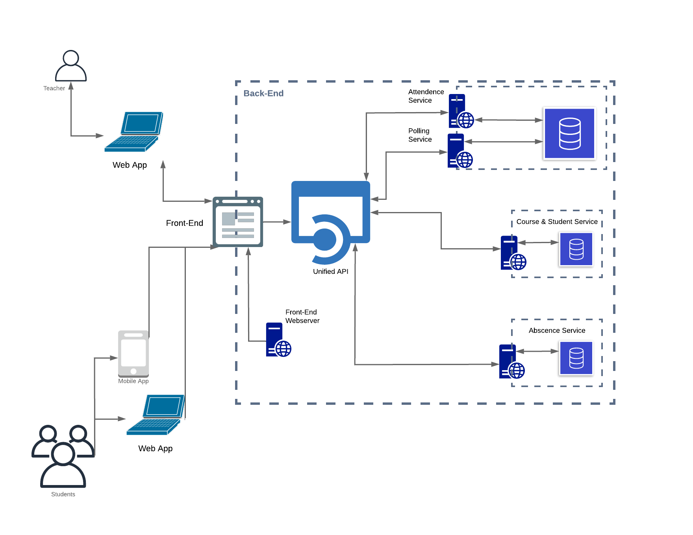
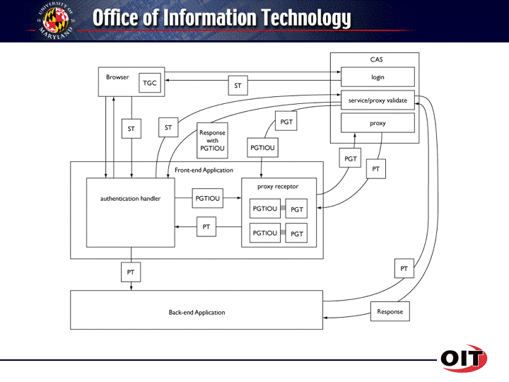

# Engage

### Education Management and Metrics SystemS

Version 1.1


Sam Barksdale

Jack Bischoff

Esteban Duran

Nir Endy

Jesse Eyler

Prashant Krishnan

Mitchell Skopic


# 1. INTRODUCTION

​	The goal of this document is to primarily communicate product specifications between internal developers, our customer Larry Herman, and our professor and project sponsor Dr. Jim Purtilo. Our product is designed to solve the problems stated by Larry Herman with extra features specified by Dr. Purtilo's desires but contingent on our scope. The ultimate outcome is a balance between both stakeholders.


#### 1.3 Purpose


####1.4 Goals

​	The goal of this project is two-fold. The project will develop a FERPA-compliant, stand-alone system which will decrease educators' level of effort for menial managerial tasks and decreases the inherent informational asymmetric involved between students and educators within large class spaces. Our system will automate or at least digitalize labor-intensive processes like absence reporting and attendance collection, as well as to provide analytics about students to professors so that they can take action during the course to improve it. 

#### 1.5 Audience


#### 1.6 Scope


### 1.7 Definitions

**Project Definitions**

1. *Users*: students who are participating in the engagement system
2. *Admins*: any educator who has authority over lectures and classes
3. *Disruptive*: any process which fundamentally breaks from an educator's normal teaching period or which unexpectedly halts an educator's teaching period. 
4. *Engagement*: the general set of metrics which describe how well a student is participating and paying attention in class. These metrics include: attendance, attention, sentiment, comprehension. 
5. *Attention*: the amount of time a student spends listening to the educator. A student will low attention might be on their phone, or might consistently leave lecture early.
6. *Sentiment*: the general feeling a student has about a lecture. This is likely a spectrum or multiple spectrums of feelings.
7. *Comprehension*: the amount and depth of information a student retains from lecture. It's synonymous with understanding.

**Technical Definitions**

1. *API*: Application Programming Interface.

  ​    

  ​    


# 2.  Product Description

​	In the following sections we detail the product we have designed to solve the problems expressed by the stakeholders.

### 2.1     Problem Statement

​	Educators struggle to track non-grade metrics like attendance and attention within large lectures and classes. They want to improve the learning outcomes of their students. Miscommunication during lectures can drive students to lower their attendance or overall course engagement. These "at-risk" students are mostly invisible to educators who can't possible remember all three hundred faces and their respective attendances. By digital login and tracking attendance, we can enable educators to discover problematic trends in their students and act upon them. 

### 2.2 Product Overview

​	We have identified three primary solution vectors to address the problem at hand. These are attendance logging, absence reporting, and population polling. The combination of these three functionality domains will provide a strong basis for general student engagement statistics and set a framework for future development. 

​	The address each functionality domain we segmented our product across four main components: the attendance service, the absence service, the polling service, and the Engage management UI. We also have a fifth service, the course service, which operates in a data support role to the rest of the application. The entire solution will be implemented through a microservice architecture.  Each component is contained within a module and operates independently from each other, reducing technical dependencies, increasing reusability, and allowing for easy extensibility by us or future developers. 

​	Yet, the deliverable application will combine each component through codified HTTP API standards to create a workflow with a singular entry-point for both educators and students. Both types of users will be able to create, read, update, and delete data, dependent on their permissions, through the front-end application which pulls live data from the backend API. In the future we imagine additional developers creating their own front-end applications or adding additional functionality to the API by adding further microservices. 

### 2.3 Product Components

​	The following will explore each component in further detail while still maintaining a product functionality perspective. We make a few top level assumptions and declarations. All services below will contain API documentation reachable through their index route, e.g. `GET [base path of API]/`. All services will further require authentication through the University's CAS for all CRUD operations to maintain FERPA compliance. 



#### 2.3.1 Attendance Service

​	The attendance microservice will handle the storage and management of attendance data. It will do so through an exposed API with access-controlled CRUD routes. We decided to construct the attendance service as a decoupled API because it allows for an ambiguous client to post and get attendance data without being bogged down in possibly varying system details. In other words, the service is system-agnostic. 

​	When the properly authorized attendance collection client makes a request to post log a student's attendance, the service will check the client's authorization and upon success, process the data as necessary, and save it to a persistent database. 

​	

In particular the attendance service shall provide the following functionality:

1. Service shall authenticate and authorize requests to enable permissions on data access.
2. Service shall expose an api route to update a student's attendance for a particular class.
3. Service shall expose an api route to read attendance data for a particular class or student.
4. Service shall expose query functionality to filter and limit attendance data based upon semesters.
5. Service shall expose an api route for administrators to update a student's attendance.
6. Service shall expose an api route to return a binary answer for a student's attendance of a requested class.
7. Service shall expose an api route to return time data for when a student was in attendance.
8. Service shall expose an api route for the verification of student's location during attendance collection.
9. Service shall allow for cancelling a class attendance.
10. Service shall **not** store student location data, if student location data becomes relevant to the solution.


#### 2.3.2 Absence Service

​	The absence microservice will handle the reporting of student absences. Like the attendance service, the absence service will be an API and database with proper access-controlled CRUD routes. The primary data stored and handled by this service is the "report". Although we can imagine a more powerful and generalized report and reporting system, the proposed iteration will restrict the report to a set of user-provided inputs. When a student submits a report, they must provide the range of dates that they were absent for, the rationale for absence, the type of excused absence, and an optional file upload. How these function will be implemented in the UI is left up to the development. 

​	

​	The Absence Service will provide the following functionality: 

1. Service shall expose an api route to create a report for a specified course and student.
2. A report shall consist of a required free text rationale, a required selection of dates missed, a required selection for type of absence, and an optional file upload for supporting documentation.
3. Service shall expose an api route to read all absence requests for a particular course or student. 
4. Service shall expose an api route to update the current state of a request. 
5. Service shall contain four states: "Waiting for Approval", "Waiting for Change", "Approved", and "Denied".
6. Service shall expose an api route to read a student's absence history.
7. Service shall expose an api route to read absence requests with filtering by status or course.
8. Service shall expose an api route to create course schedules.
9. Service shall expose an api route update course schedules.
10. Service shall expose an api route to read a student's missing assignment list.


#### 2.3.3 Polling Service

​	The polling service will handle the creation, deletion, publishing, and storing of polls and their associated data. Polls are short questions created by the educators aimed at gauging some form of sentiment or data from the student. These are not graded quizzes and shouldn't be used to test student's lecture knowledge. Polls are for data collection from the student population which can then be used to influence the educator's lectures or for other data analysis applications. 

​	We will support two types of polls: free-form and limited answer. Free-form polls allow for free input form the students. Limited answer polls are multiple-choice or binary answered polls. These types of polls can also have an additional option to support multiple selections. 

​	Polls can only be created by an educator and are not viewable by students until the poll is published. Published polls can have a fixed time limit after which they expire, or can be manually closed by the educator. Polls can only be published to all students on a per class basis. Created polls can be reused by publishing the to different class spaces. The service will not support updating or changing answers due to the non-graded nature of the polling functionality. 


​	The Polling Service will provide the following functionality: 

1. Service shall expose an api route to view all polls in a course filterable by their active, expired, published, or unpublished status and/or by their course or section. Service shall provide the option to include answer data within the response dependent on user permissions. 
2. Service shall expose an api route to create a poll.
3. Service shall expose an api route to publish a poll to a provided class space. 
4. Service shall expose an api route to edit a poll's information. Note: published polls cannot be edited since editing them could invalidate previous responses. 
5. Service shall expose an api route to delete a poll and all associated data.

####2.3.4  Front-end Application

​	The normal use cases of students and educators will be handled visually through a web and mobile based front-end application. This application will provide a convenient and familiar mechanism for students and educators to interact with the management back-end. The complete functionality of the front-end applications will change between user types but will remain fairly constant between the Web, Android, and iOS implementations. To ensure the relative ease of cross-platform development, we will utilize the React Native framework, which allows for a React-enabled web application to be run on mobile devices, natively, through specific bindings. 

> ​	**Note**: Although our product will revolve around the front-end application as a client for the back-end, we chose the microservice framework so that other authorized developers can create additional UIs with separate scopes or programmatically query for data off the microservice mesh for usage in custom data analytics. 

​	For a full rationale for this decision, see section 2.8. In summary, the mobile implementation provides a set of features which garner a higher confidence in the accuracy of our data, and provide us a platform for continuous analysis and richer features. Yet, the web implementation gracefully supports privacy-minded students and offers a traditional mechanism for "power-user" administrator functions. 

​	Both students and educators will access the same web application, but the view will change dependent on their LDAP permissions. Educators are given a view structured for data analysis whereas students are given a view structured towards data input. In other words, educators will see more graphs and no absence reporting, but students will see the opposite.

​	Functionality is split between educators and students.

**Educators**

1. Educator can view their active courses.
  2. Educator can select an active course for a more detailed look.
  3. Educator can view and switch between types of class.
  4. Educator can view all sections of a course.
  5. Educator can create a course with a name, sections, meeting times, student rosters, and locations. 
  6. Educator can update a courses' name, meeting times, sections, student roster, and location.
  7. Educator can view attendance at the course level.
  8. Educator can view attendance at the section level.
  9. Educator can view a list of active students at the course and section level.
  10. Educator can select a student for a more detailed look.
  11. Educator can view a student's attendance across all the Educator's courses.
  12. Educator can view all outstanding Absence requests. 
  13. Educator can accept, deny, or request changes for any absence requests.
  14. Educators can view an absence request in detail with all form fields visible.
  15. Educators can view all active and historical polls. 
  16. Educators can create polls with a question, time limit, type of answer, and answers (if applicable for types of answer).
  17. Educators can view answer data from particular polls.
  18. Educators can delete polls.
  19. Educators can publish polls which allow for students to access them.
  20. Educators can download aggregate class data in a CSV format.

**Students**

1. Students can view their active courses.
2. Students can view their attendance for their active courses.
3. Students can access and submit an absence request form.
4. Students can view their history and the details of absence requests. 
5. Students can view their attendance history filterable by course.
6. Students can be notified of the coursework they have missed.
7. Students can view if their attendance was successfully checked and manually check-in if need be.
8. Students can view active polls created and published by their educator. 


#### 2.3.5 Course and Student Service

​	The Course and Student Service is a supporting application which acts as a central service for the collection and CRUD of course and student data. This service will handle the initial setup the educator performs to create their course. Updates to course times, meeting locations, and student rosters will occur in this service. Other services simply use this API for access to that data. 

1. Service shall expose a route to read all course by user id.
2. Service shall expose a route to read all students by course id.
3. Service shall expose a route to create a course with a name, sections, locations, times, and student rosters.
4. Service shall expose a route to edit a course's name, times, locations, sections, and student rosters. 
5. Service shall expose a route to delete a course.  

###2.4 Customer Characteristics

** **

​	There are two main end-users for our system: educators and  students.

##### Educators

​	 Educators will interface with the system to perform the majority of the key functionalities presented. First and foremost, the application provided will allow a place for educators(s) to see aggregated attendance information for individual students. This information will be collected whenever the educators(s) deem fit during the lecture. The application will also show basic descriptive statistics on class-wide attendance information. The application will also provide means of aggregating information offered through the class engagement activities. This information will be aggregated and summarized in brief snapshots for the educators(s) to display to their class should they want to. Additionally, educators(s) will have the ability to review and assess the numerous incoming absence request forms and approve/deny them based on the information provided. This approval process will also provide educators(s) with a means of reaching out to the student(s) that will be absent and notify them of missed activities or possible deadline extensions for assignments. Finally, the application will provide means for the educators(s) to view aggregated attendance data, along with other desired metrics such as submit server information, in an aggregated fashion where they can use different sources of information to cross-correlate and get a more accurate understanding of how not only the entire class is faring, but how individual students are doing as well. 

##### Students

​	Students will be mainly interfacing with our application for four key functionalities. The first is their ability to check-in to class when specified by the professor through the geolocation capabilities of our application. This information will be automatically recorded and will also be presented to the student - although they will only be able to access their own attendance records - this in turn would fulfill the second key requirement. The third key functionality is the ability for students to submit absence request forms to their instructor(s) in the case that they will not be able to make it to class, and be able to receive any feedback from the instructor based on the date(s) of absence. Finally, students should have the ability to to interact with in-class engagement activities set forth by the professor during lectures in the form of live questionnaire responses. In terms of specific platforms, we are aiming to get a mobile-friendly web product available to the students, however should time permit, we will also tbe aiming towards native mobile applications to help ease the overall workflows. If we have more time left-over even after that, we would be looking into developing Elms plugins to help limit the number of extra software's required for the students and the instructor(s).	


### 2.5  Delivery Manifest

​	We plan to deliver a fully streamlined educational management pipeline consisting of a front-end interface application and a supporting backend which is in itself composed of the absence and attendance services.

####2.5.1 Front-end application

​	At the official launch the front-end application will consist of one Web application and a mobile application for both the Android and iOS operating systems. These three applications will mirror each other in functionality, although the Web application will contain a richer feature set due to the desktop's more powerful capabilities. At launch the front-end applications will provide:

1. A means for students and educators to view attendance for their active courses.
2. A means for students to log their attendance.
3. A means for students to submit an absence request.
4. A means for students to view active and past polls.
5. A means for students to answer polls.  
6. A means for educators to view attendance per course, section and student.
7. A means for educators to view all outstanding absence reports per course, section, student, and type.
8. A means for educators to create and save a poll and provide poll text and available answers if applicable. 
9. A means for educators to edit unpublished polls.
10. A means for educators to publish a saved poll to a class.
11. A means for educators to see all responses to a poll.
12. A means for educators to download data by class.

#### 2.5.2 Absence Service

1. A means for students to create an absence report.
2. A means for students to read all their absence reports.
3. A means for students to read the status of an absence report.
4. A means for educators to read all absence reports by course, section, type, and student.
5. A means for educators to read the details of absence reports.
6. A means for educators to update the status of reports.

#### 2.5.3 Attendance Service

1. A means for students to create an attendance event for a particular class.
2. A means for students to read their historical attendance for all their active courses.
3. A means for educators to read attendance per course, per section, and per student.

#### 2.5.4 Polling Service

1. A means for educators to create a poll with question text, class space, and answers (if applicable).
2. A means for educators to delete a poll.
3. A means for educators to update an unpublished poll.
4. A means for educators to update a poll's state to published.
5. A means for students to create an answer to the poll.
6. A means for students to read their answer from polls. 


## 2.6     Team Management

```
How we will organize to reach the timeline specified below. Which teams will we have? What are they responsible for? How will we work in parallel?
```
We will employ an Agile methodology with weekly sprints.


## 2.7     Timeline

```
What is our timeline to finish the project in the scope of the semester? What deliverables will we finish when? How will we handle taking on new features (in addition to the attendance task?)

From Purtillo: We will want you to call out at least the major tasks, story lines or activities necessary to complete your project, and show how composing them should lead to success. Then, as you proceed with the build, we will want you to maintain (e.g. on one of your groups' web sites) a graphic summary of the status of completion, so we can track progress. Are you getting closer or further away from success? The 'manager' will want to know at a glance. (We will talk more in class about a variety of tools for this, such as JIRA or Trello. We hope you will come to see such tools as aids to success, not busywork or barriers. Learn to use these to improve your productivity.) The cost estimate should be consistent with the timeline; potentially you will reflect on how to create a Gantt chart
```


## 2.8     Alternate Solutions

```
There are two great ways to ensure your green light process is painful, drawn out, complex and jam packed with frustration. One is to submit a proposal that does not include analysis of alternate design approaches with an explanation as to why one has been chosen in particular.
```


​	Throughout the planning and design process, we explored many interpretations of the problem space with varying degrees of scopes, along with numerous product solution ideas and iterations. Consistently, we found ourselves crafting solutions far too ambitious given our hard time constraints. We first considered a "game-ified" engagement application which sought to improved student engagement. Then with new insight from Dr. Purtilo, we found our problem might lie within the data collection and aggregation space. We went from a more visual interactive plan to a data infrastructure application designed to drive data-informed decisions. A rough cost analysis revealed the development of such a robust system would take more than double the time we have in a semester, so we scaled down our product to our current iteration. 

​	 Ultimately, we balanced Dr. Purtilo's expectations with our main customer Larry Herman, and arrived at a mixture of an institutional data framework focused on educational management. Instead of prescribing data insights, we provide a backend application for querying data which will ideally be extended upon, gathering data from multiple sources, both online and digital. 

​	This section is dedicated to exploring some of those decisions we made and paths we decided not to travel. Hopefully this will provide evidence of our teams extensive design process, and guide future developers building modules for our system. 

Ultimately, we decided to prioritize Larry Herman's desire for overall course management. Still, we eventually figured out ways to rectify the apparent disconnect between management and engagement. Class attendance is a form of engagement, and a telling one; creating a foundation for simple student-instructor interactions is an essential step towards improving overall educational outcomes.

##### 2.8.1 Front-End Implementation Rationale

​	There was considerable technical debate around the specific implementation of the front-end application. Ultimately, we decided upon a hybrid decision of web and mobile. Despite the additional complexity of mobile development, both platforms provide unique advantages separately, and a robust system when used in conjunction.

​	From a human-computer interaction perspective, we find it more likely that an educator would use the web platform because it suites the "power-user" administrator functions better than a mobile application. On the other hand, the simpler actions performed by the students match the form factor of a mobile application.

​	Technical considerations also influenced this decision. One of the crucial goals of this product is to provide an automated or digital means for attendance collection. Yet, UMD policy states that attendance cannot be graded for lectures, which makes incentivizing user-initiated attendance check-ins challenging. Although the educator could make a persuading argument about the benefits of cooperating in such a system, leaving such core functionality up to trust and hope allows for too great an error. 

​	There are many scenarios where a student could fail to check-in. One reason could be tardiness. A student who arrives late to class might be too flustered and could easily forget to check-in. A student could have also left momentarily while the educator was reminding the class to check-in (such a constant reminder would become tedious for both educator and student ). An educator themselves may have forgotten to remind students. Then, there is the unfortunate instance of apathetic students. It's not hard to imagine, particularly, in lower-level classes, a signficiant student body who wants to coast through college and cares little about educational outcomes and student-educator relationships. They most certainly will not undergo the hassle of manually checking-in.

​	With a mobile implementation, we can passively check a student's attendance without them performing any action. Not only is this more convenient for the student, but also captures attendance with better degree of accuracy. We can attribute an exact number of students who were verifiably in lecture. The manual check-in system is more sensitive to human and environmental factors, leaving it susceptible to false-negatives.  Additionally, a native mobile implementation allows for a greater range of future functionality and control, including but not limited to: access to device lifecycle, device status bar, device UI, file system, efficient push notifications, and native camera support. These are features we think would be beneficial to students and would outweigh the possible negatives of having a small installed application and discrete location polling. 

​	However, the web implementation offers a graceful alternative for students who are concerned about the mobile application's privacy permissions, specifically its geolocation capabilities. The web implementation will ultimately provide similar functionality for the student, it will just lack some of the convenience features like automatic check-in, native camera upload support, and 24/7 push notification support. 

##### 2.8.2 User Adoption

​	When designing for engagement, we considered gamification of engagement data such as questions asked and time off screen. Users could accrue virtual points, similar to Reddit "karma", and see their progress on leaderboards or in other rewards. We looked to combine apps, such as Pocket Points and Top Hat, to create an innovative learning platform. 

​		We have struggled to imagine why a user might want to participate in our system. Why should they download an app or log into a website? Particularly, if that application will "hold them accountable" by collecting attendance and engagement data; no one wants to be held accountable. 

​	If we had a subtle manner of tracking attendance which doesn't depend on any user interaction, then the question would be trivial. We can imagine systems which use local cell towers to find the location of cell phones, or wireless access points which track cell phones as they automatically ping near-by Wi-Fi networks. One of our initial designs did include a Wi-Fi router or other WAP bootstrapped off the educator's computer which students could connect, thus verifying their attendance. Yet, many of those solutions were technically advanced, costly, possibly illegal, and probably immoral.

​	Such lightweight and "hidden" solutions also lack extensibility. Since the problem can be applied to the question of engagement, generally, we desire a system capable of tracking other engagement metrics. Calculating the ratio between a student's screen time and listening time would mostly likely be intractable using clever methods like packet listening on a "lecture Wi-Fi network". Nor would it solve issues regarding student-educator communication outside the lecture walls.

​	We wallowed in this design impasse for a few weeks. Finally, we looked at the application from the user perspective. What would it take for a student to *want* to download the application? Could we provide a whole suite of functionality enticing for students and then "sneak" in an attendance logger?

​	The answer is probably. In discussion with Larry we discovered that he would reduce his no-device policy if the devices were being used for some form of educational polling. Additionally, he expressed interest in digitalizing the excused absence procedures or other student-based requests such as project extensions or get-out-of-jail free cards. Attendance cannot be graded, but quizzes can, which gives a student a good reason to answer them. Additionally, students love to claim excused absences and request extensions, and if they already need our application for polling and think they'll claim extensions or excused absences, they might as well download the mobile application. Including those extra features, should provide a much greater drive for user adoption. 

> ​	 **Note**: Why isn't polling through clickers (by Turing Technologies) good enough? Firstly, clickers cost somebody money, either the University or the students. Second, clickers are easily forgotten, easily broken, and lack flexibility. Physical devices incur the wrath of human factors, and proprietary technology becomes antiquated and eventually problematic. There is also the extra work required for an educator to create non-trivial quizzes, while the actual process of responding to polls may disrupt the flow of the class-room. Clickers are also restricted by time and location and answer format. A more robust polling system, like ours, will ensure location without clunky physical devices and transcend both time limitations and answer formatting limitations. 


​	Given our extendable framework, future developers can add features which provide even more value for students. Returning on the gamification of the system, other developers can implement leaderboards, badges, and integration with software such as Portfolium could provide a game-like drive within the college atmosphere as well as post-college benefits. It seems likely that college engagement and participation metrics would be of great use for employers to gauge a new graduate's personality, work ethic, and teamwork skills.

​	In the meantime, we also imagine non-technical solutions which can drive adoption Although attendance and general engagement cannot be graded, there might be room for an educator to give out "good faith" points. Students whose profile leans towards higher engagement, might be at a better bargaining position for a slight grade bump-up at the end of the semester, an assignment extension, or letter of recommendation. Further, the educator could argue, the analytics they collect can directly improve the lecture, leaving the students more satisfied and with a higher GPA. 


##### 2.8.3. Geolocation

​	There are many technical risks surrounding the geolocation capabilities of our solution and we mocked up a few different solutions. Firstly, acutely accurate geolocation relies on a combination of GPS, cell tower triangulation, and Wi-Fi network connectivity. Tracking attendance based upon geolocation has many degrees of failure. If GPS is unable, then any form of geolocation is essentially impossible. Further, even with a GPS connection, location accuracy may be too imprecise. Relying on cell tower and Wi-Fi triangulation can help us pinpoint locations, but if any of those are inaccessible, then the problem of accuracy remains.

​	Ostensibly, we probably need to know the exact classroom location of a student. However, there may be unique correlations in reality that we can leverage. Firstly, we can assume that interesting geolocation points are areas which contain a large amount (80+) of users during a particular time. Suppose we have many students registered in the same class. `Students 1...N` have an accurate GPS signal but `Student N+1` does not. Given these circumstances, it might be possible to claim, with a certain probability, that `Student N+1` is present in the class if they are within a certain distance threshold to `Students 1...N` .  

​	Alternatively, we might be able to leverage a slightly simpler heuristic. It may not matter what classroom the user is in after all. Given a student in a class which has a class start time and a building location, it might be accurate enough to claim: if a student is in the same building as their class during the class' interval, then it is reasonable to assume the student is in attendance. 

​	For the simplicity, we have decided on using building coordinates as a geolocation bound, but if given enough time, we would like to explore a more accurate solution. Instead of inputting a building, the educator could have the option to calibrate the bound based on their physical location. On or before the first day of class, the educator can travel to the classroom and calibrate the location. Our system would then get a much more accurate coordinate to use in the geolocation bounding.


# 3. System Design

### 3.1 Core Technologies

This section describes the core technologies that will be used for each level of the development stack, as well as for other necessary functionalities such as geolocation tracking and image uploading. 

**Database:**

**Back End:** NodeJS, 

**Front End:** Javascript (ES6+), React Native Framework

**Geolocation:**


### 3.2 Data Schemas

##### 3.2.1 Access Control

| Permissions               | Educator | Student | Notes                                    |
| ------------------------- | -------- | ------- | ---------------------------------------- |
| List self data            | Yes      | Yes     |                                          |
| List student by ID        | Yes      | No      | Iff student enrolled in Educator's class |
| List students by course   | Yes      | No      | Iff course owned by Educator             |
| List student's attendance | Yes      | No      | Iff student enrolled in Educator's class |
| List self attendance      | -        | Yes     |                                          |
| Create self attendance    | -        | Yes     | Iff student meets attendance constraints |
| Create student attendance | Yes      | No      | Iff student enrolled in Educator's class |
| Update student attendance | Yes      | No      |                                          |
|                           |          |         |                                          |


### 3.3 Data Dependencies

##### 3.3.1 Authentication and Authorization

​	This document has previously referred to login and access-control systems. Rather than create a from-scratch authentication system, we will rely on the University's Central Authentication Service (CAS) which is a protocol for Single Sign-on (SSO). The University currently achieves their SSO system through Shibboleth, a privacy-centric, open-source, education-oriented SSO solution. 

​	Shibboleth works as any other SSO. A user attempts to access a protected resource and, assuming they do not have an active session, are redirected to the service provider, which will in turn submit an authentication request to the identity provider with the user's credentials. The identity provider is responsible for the authentication process, and assuming the credentials are correct will return a success response. This response will be handled by the service provider, allowing the user to access the resource.

​	Shibboleth has an excellent explanation [here](https://www.shibboleth.net/index/basic/).

​	We will use the returned authentication response and the authorization user attributes to make access-control decisions. The Office of Information Technology provides a graphic displaying the necessary steps an application performs to integrate into CAS:



##### 3.3.2 Submit Server

​	The University Submit Server operates as a submission and testing framework for the University's computer science students. We plan on using the data stored on the server for metrics integration within the front-end application. With submit server information, the educator can easily include submission data within their greater education analytics, possibly uncovering underlying issues in lecture or discussion spaces. 

​	
# 4. TIMELINE
Below is the timeline, beginning October 28, to have a fully functional prototype by November 20. It is divided into tasks within the services and products described in the Cost Estimate. The range of each task is in the brackets preceding the name of the task. Highlighted dates represent hard internal deadlines. Most deadlines fall on our weekly meeting dates, or class days; this maximizes team accountability and communication. We will be using Trello to track each task.
Logistics
•	[10/10 – 10/28] Design Product and Write Proposal for Green Light
•	[11/3] Week 1 Meeting
•	[11/10] Week 2 Meeting
•	[11/17] Week 3 Meeting
•	[11/22] Prof. Purtilo Review
•	[11/24] Review Meeting and Improvements Planning
•	[12/1] Week 5 Meeting to Discuss Acceptance Testing
•	[12/1 – 12/5] Acceptance Testing
Back End
•	[10/10 – 10/31] Design Data Schema
•	[10/31] Team Approval of Data Schema
•	[10/31 – 11/3] API Route Definition
•	[10/31 – 11/12] Query Logic
•	[10/31 – 11/14] Admin Privileges
•	[10/31 – 11/17] CSV Export
•	[10/31 – 11/20] Testing
•	[11/20] Functional Back End
Front End
•	[10/10 – 11/3] Lo-fi Prototyping (web, iOS, Android)*
•	[11/3] Team Approval of Lo-fi Designs (web, iOS, Android)*
•	[11/3 – 11/12] Admin UI Implementation (web, iOS, Android)*
•	[11/3 – 11/17] Student UI Implementation (web, iOS, Android)*
•	[11/3 – 11/17] Testing (web, iOS, Android)*
•	[11/17 – 11/20] Team User Testing (web, iOS, Android)*
•	[11/20] Function al Front End (web, iOS, Android)*
•	[11/17 – 11/22] Advertisement Design
•	[11/22 – 12/5] Advertisement Implementation
*Front End small group will determine internal deadlines for web, iOS, and Android implementations
Attendance Service
•	[10/10 - 10/31]  Design
•	[10/28 – 11/3] GPS API
•	[11/3 – 11/10] CAS API
•	[11/10 – 11/15] Creation of Special Event Case
•	[10/28 – 11/20] Testing
•	[11/17] Integration into Functional Product
Absence Service
•	[10/10 - 11/3] Design, Including Proof Reporting
•	[11/3 – 11/10] Admin Absence Approval
•	[10/28 – 11/20] Testing
•	[11/17] Integration into Functional Product
Polling Service
•	[10/10 - 10/31] Design
•	[10/31 – 11/5] Admin Poll Creation
•	[11/5 – 11/10] Student Poll Responses
•	[11/10 – 11/15] Viewing Poll Results
•	[10/28 – 11/20] Testing
•	[11/17] Integration into Functional Product

# 4. TESTING

Weekly the team will meet to set priorities over the product's development and delegate these tasks to build. Throughout this process, the product will undergo three different types of tests to verify and ultimately validate the competence of the product.

The first type of test is basic functionality, where each function of a microservice will be made sure to work correctly. For example, the excused absence service if the files submitted as evidence of valid excuse get uploaded and appropriately stored the system database.

The second type of test is Alpha testing of individual microservice, to verify that each microservice accomplishes its task with the system as a whole. Here the microservice must have all of its essential functions working to secure it's working correctly.

The last type of tests is Beta testing. With our client's aid and permission, a class of instructor Herman will be subject to test our product. Hermann will test educator account experience, where he will create a class with the services that have produced. And his students will download the app and be the subjects of the data collection and administrative functionality of the course. Here, it is crucial that the Beta testing follows without disrupting the class progress; if it does, the test will be considered a failure. If the product doesn't interrupt the workflow of the class and performs accordingly, the product will be regarded as validated.

**Verification**

Verification will be done in the form of Alpha testing on the various components of our project. We will be conducting white box testing specifically in the form of unit tests and integration testing during this period. We will split our data between developer generated data that we will would best test the limits of each of our individual microservices as well as our front-end. The following outlines the key abilities that we w ant to verify for each of the microservices (these are more general technical requirements taken from the delivery manifests for each service seen in section 2.5): 

**Attendance** - *Standard CRUD Operations - Instructors specifically, students may only create and update records onto the system), concurrent requests, geolocation verification and appropriate updating for students, timely updates of student attendance records*.

**Absence** - *Standard CRUD Operations- (instructors and students), concurrent requests, timely updates*.

**Polling** - *Standard CRUD Operations - (instructors and students), concurrent requests, timely responses*.

**Courses (Onboarding)** - *Standard CRUD Operations - (instructors - specifically for the creation of their different class sections and all the appropriate information to go along with it)*.

**Front-end** - *Standard CRUD Operations, concurrent requests, geolocation verification and appropriate updating for students, timely updates of student attendance records*.

In terms of testing the microservices, the main errors we are looking to expose are the following: 

*Logical Errors*

*Stress / Load errors*

*Timing*

Testing our front-end will be more straightforward. While checking for fidelity is important, we have our mockups which we can refer back to too ensure that we are capturing the key functionality and user experience design in each one of our main pages. 

**Data Decision**

Our tests will be driven by data that we will have flexibility in generating. The data we will be playing with here is very much dependent on knowledge of the system. 

Judgement of out desired output will be left to the development team to assess. 

## 4.1  User Acceptance Testing  (Beta Testing)

 **Acceptance Testing**

Acceptance testing will be carried out as a validation activity. Along with our verification activities, we want to also offer consistent acceptance testing to be carried out throughout our development process. With more consistent input from our end-users, we ensure that we are capturing appropriate functionality and continually verify that what we *say* is also what we *mean*. In this way we also avoid the situation where changing needs are not met, as we are in constant contact with Professor Herman and Professor Purtilo and they are ideally never left in the dark. We also want to establish testing environments with our other key end-users, the students themselves.  In this sense, it is also important that we get testing environments centered around the student experience.

When assessing our results from validation testing, we are looking specifically for instances where our application functionality is not meeting a need within a particular workflow. Due to our rigorous verification testing up until this point, we want to have confidence in the fidelity of our system when it comes to our envisioned workflows. However, in order to create a robust system we will need to have an input of user-defined data to truly stress test the limits of our system. 

As a result, in the following tests we will be putting an emphasis on getting feedback on our front-end user experience in addition to making sure that both the professors and students are happy with the necessary workflow and captures what they are envisioning. Additionally, we will be using qualitative means of assessing whether or not the workflow we captured within our application and its associated functionality is something that was captured appropriately. 

Our testing will be done in two key settings. The first will be periodic testing with Professor Herman and Professor Purtilo where we will have them interact with the instructor section of the application. The primary focus of these tests will be to ensure that all independent (out-of-classroom) workflows for the instructors are fully met and any inconsistencies can be ironed out. 

Following the technical results, we will further inquire with both professors on whether or not they were satisfactory with their workflows for completing each of the core functionalities in the form of a simplistic survey, where they will rate their satisfaction as well as ease of use for each of the main feature modules. We will also ask for any additional comments or suggestions that they might have. 

The second setting for our user tests will take place in the classroom. We have already made arrangements with Professor Herman that we will be able to come in during a few of his lectures to his students and test our platform on either a small subset, or a large subset of the students. Additionally, during the test, two members of our team will be sitting with Prof. Herman while the rest will be available to answer any questions from the students. 

Before we start the experiment, we will do a quick brief with the entire class of what the experiments main goal is. We will let them know that they will have instructions to follow during the entire process, but should the application break or fail for any of the students that they let us know immediately, as it is important to make sure that we record any and all instances of the application breaking. Although at this point it is assumed that we have done extensive verification tests on our end of the system, we need to make sure that we are still ready for components of the application breaking during day-of. 

**Success Criteria**

Below shows the ideal workflow that we will be looking for within our classroom testing environment. This will be our guiding light for our success criteria. 

·        In the beginning of the lecture, Lecturer Herman is able to successfully and timely log into his platform and will proceed to ask rest of the class to access our application through the web.

·        Students will take the time to login to their account through ELMS. All students will be able to log in successfully and will be able to successfully select the current class object as it will automatically populate their dashboard

·        Students will be able to successfully check-into class through the geolocation capability of our platform

·        This attendance information will be able to populate live on Prof. Herman’s end of the system and the amount of people who are successfully able to login versus those that are recorded in Prof. Herman’s system should be equal

·        Prof. Herman should be able to quickly and easily create an engagement activity and broadcast it to the class with the push of a button. Prof. Herman can launch these engagement activities at his leisure however we request that at least two of them be performed during the lecture

·        Students will answer the engagement activities through our platform during the specified time and all of their responses will be tabulated accurately and be immediately available for view on Prof. Herman’s end of the system. 

After the test, we will be sending out a short survey once again to the students that participated in our trial. The following highlight the main questions that we will be asking – most of them will be a question that allows students to rate both the ease of use and usefulness of the various features. There will additionally be some free – response questions towards the end:

**Free Response Survey** 

*On a scale of 1 – 10 how easy was it to use the check-in ability?* 

*How do you compare this check-in ability to the traditional clickers? (If you have had the opportunity to us them before)*

*On a scale of 1 – 10, how useful was it for you to be able to see your own attendance data and the descriptive statistics that came along with it?* 

*On a scale of 1 – 10, how easy was it for you to participate in the engagement activity set by Professor Herman?* 

*On a scale of 1 – 10, how easy was it for you to ask for absences WITHOUT our system?* 

*On a scale of 1 – 10, how easy was it for you to ask for absences WITH our system?* 

*What features do you think are unnecessary in the application?* 

*Please add any additional comments that you might have. Please note that at this time we are not taking any requests for additional features, please feel free to comment on the features that you were able to experience and suggest improvements around them.* 

Validation of results will be take place as assessment of the success rates that we got to analyze during our different testing environments. Because of the nature of what we are recording, it is very important that we do not settle for anything less than 100% accuracy when recording student attendance information as well as when documenting incoming absence requests. For this reason, it is important that we carefully document anything that goes wrong during the trials as we want to make sure any inconsistencies are not a result of the underlying platform. Validation assessment will also take a very qualitative aspect to it. This is because a key aspect of our system is going to be the ease of use for both the students and instructors. As a result, in order to best quantify the user experience, the questionnaire shown above will give us the necessary data required to make changes to the front-end. 

Before the check-in process, we will take a headcount of everyone that successfully was able to submit their attendance versus their recorded information on our database. We will do the same with the engagement service to make sure our application is picking up all key activity. 

Therefore the success of our application is heavily based on the success of the above workflow mentioned and ticking all of those boxes. 

Below we have outlined more of our technical criteria for success in various aspects of our application: 

**Database Connectivity**

We will need to ensure that the data we write onto the database is accurate and gets inputted in a timely manner. In terms of the instructor portal, this means that their CRUD operations that they can leverage on their dashboard are accurately represented in the database. Linking back to our tests, this would primary take place in the individual sessions with Prof. Herman and Professor Purtilo. We will ask them to specifically test out the admin application as much as they can and we will continually verify that nothing is broken. 

**Absence Management**

Absence management will be catered too more carefully. A big part of this system is time sensitive as requests have to be logged in and approved in the order they came in. During our class testing environment, it is unlikely we will be able to fully test this functionality, so the majority of this application will be tested through scripts that we write and manual testing. Although we would like validation testing to be catered with our end-users, we are also conscious of the fact that we may have relatively stringent time period to work with and as a result we feel that developer testing on our absence management system should be adequate. Our goal will be to overload the system with requests but make sure the requests are logged in the time that they are received and nothing breaks again. 

**Engagement Management**

Engagement management is something we will mainly be testing in the class environment. While we are able to test this with Professor Purtilo and Lecturer Herman's individual tests, a class environment would represent the scale that we are trying to accommodate. As a result we are looking for accurate recording of information and no loss of data. We want to accurately capture the data given by students during class and so it is important that any losses do not occur because of a lack of robustness in our platform. 

**Speed**

We need to ensure that the speed of the application does not contribute to any form of disruption within the class. As a result, the relative speed of the application will be important. Heavy reliance on third party API's for fetch requests in our data might increase latency and deep queries into our database might also contribute to increased lag in our application. As a result it is important that these do not become a hindrance. As a result, we are setting the following time-limits for validation that our application is non-disruptive. Check-in will happen and be successful within the first 10 minutes of class.

Furthermore, anytime one of our services fails on the instructor side, there should be no averse consequences to the workflow of the rest of the class. As mentioned in the beginning of this section, should the system be disruptive in any way, our application will have failed regardless. It is important that should any aspect of the system go out of form, that we the consequences can be fairly contained and both the instructors and students can move on normally with the rest of the class.                                                                                                                                                                                                               

# 5. COST ESTIMATE


# 6. PRESS RELEASE

**Engage application increases engagement and eases lives of students and teachers.**

_Engage team has developed an application to streamline tedious applications._

COLLEGE PARK (NEWS WIRE). - October 30th, 2019. Today, Engage, a learning software company specializing in easing the lives of teachers/students and enhancing student engagement announces the reveal of their long awaited class tool. This tool will enhance the lives of not only teachers, but students as well. Tedious actions such as teachers sifting through endless emails finding the "hey sorry I missed class!" has been converted into a seamless task that saves countless hours. [INSERT TEAM NAME] has also streamlined requests made to the teacher such as asking for extensions, grade changes, and submitting excuse reports. 

According to one of Engage's lead developers, Esteban, "This application will enhance the daily lives of teachers and students tremendously. Administrative tasks that teachers reluctantly finish with skeptical accuracy and student's requests potentially being lost in a sea of the Professor's emails have been made astronomically simpler and easier to track. We look to make tasks like taking attendance in a 300 person classroom easy and seamless."

Leading up to this solution, surveys were taken in classrooms and data was collected to support the need for a product to enhance the lives of teachers and engage students more. Engage looks to make their big break and step in the learning software scene with a large impact.

More information can be found at ______ (website tbd).

# 7. IP STATEMENT

 Engage is a pedagogic data collection and administrative task integration software. The University of Maryland grants all the intellectual property rights to students for software developed during their academic experiences. The data collected with the product will satisfy FERPA compliance; the student data collected will be only available to the educator using the product and the individual student. The open-source tools, Javascript, Graphql, and React, used for the development of the product fall under the MIT license.

####UNIVERSITY OF MARYLAND INTELLECTUAL PROPERTY POLICY, section V.D.3
"Students shall own all rights, title, and interests, including Intellectual
Property rights, in Inventions, Software, Research Data and Tangible Research
Materials they create, conceive or reduce to practice in the performance of their
academic and research activities whether or not they use Significant University
Resources provided they are not owned by the University under Section V.D.1."
####MIT License
"Permission is hereby granted, free of charge, to any person obtaining a copy of this software and associated documentation files (the "Software"), to deal in the Software without restriction, including without limitation the rights to use, copy, modify, merge, publish, distribute, sublicense, and/or sell copies of the Software, and to permit persons to whom the Software is furnished to do so, subject to the following conditions:

The above copyright notice and this permission notice shall be included in all copies or substantial portions of the Software.

THE SOFTWARE IS PROVIDED "AS IS", WITHOUT WARRANTY OF ANY KIND, EXPRESS OR IMPLIED, INCLUDING BUT NOT LIMITED TO THE WARRANTIES OF MERCHANTABILITY, FITNESS FOR A PARTICULAR PURPOSE AND NONINFRINGEMENT. IN NO EVENT SHALL THE AUTHORS OR COPYRIGHT HOLDERS BE LIABLE FOR ANY CLAIM, DAMAGES OR OTHER LIABILITY, WHETHER IN AN ACTION OF CONTRACT, TORT OR OTHERWISE, ARISING FROM, OUT OF OR IN CONNECTION WITH THE SOFTWARE OR THE USE OR OTHER DEALINGS IN THE SOFTWARE." 

The product may be used, modified, and redistributed, any instantiation of the product mention the licenses provided and any modification of the code is explicitly stated. Any other restrictions are subject to the licenses above. 
